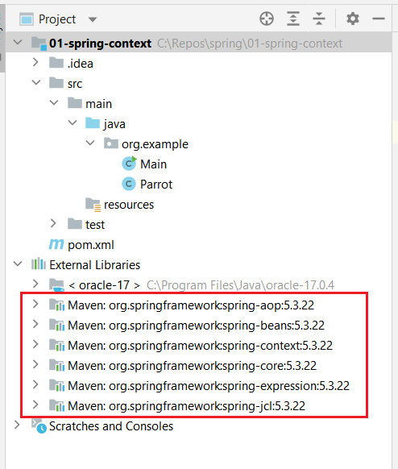

## The Spring context

Imagine the context as a place in the memory of your app in which we add all the object instances that we want the framework to manage.
We’ll name these object instances **beans**.

A **bean** is any class that spring is managing its lifecycle.

You can add beans in the context in the following ways:

* Using the `@Bean` annotation
* Using stereotype annotations
* Programmatically

The example [01-spring-context](01-spring-context/) shows the use of the Spring context and the creation of beans.
For that, you have to add the following dependency to your maven `pom.xml`file:

```xml
<dependency>
  <groupId>org.springframework</groupId>
  <artifactId>spring-context</artifactId>
  <version>5.3.22</version>
</dependency>
```

It will download and add the following jar libraries to your project that you can find under the *External Libraries* section in the project structure:



### Using the `@Bean` annotation

The steps you need to follow to add a bean to the Spring context using the `@Bean` annotation are as follows:

1. Define a configuration class annotated with `@Configuration`.
2. Add a method to the configuration class that returns the object instance you want to add to the context and annotate the method with the `@Bean`.
Spring calls this method when it initializes its context and adds the returned value to the context. 
3. Make Spring use the configuration class defined in step 1.

```java
@Configuration
public class ProjectConfig {
    @Bean
    Parrot parrot() {
        return new Parrot("Koko");
    }
}    
```
```java
public class Main {
    public static void main(String[] args) {
        var context = new AnnotationConfigApplicationContext(ProjectConfig.class);
        Parrot p = context.getBean(Parrot.class);
    }
}
```

If there are multiple beans of the requested type you get the exception `NoUniqueBeanDefinitionException`.
To solve this ambiguity problem, you need to refer precisely to one of the instances by using the bean’s name. 
By default, Spring uses the names of the methods annotated with `@Bean` as the names of the beans themselves.

Alternatively, you can make one of the multiple beans of the same type in the context *primary*, using the `@Primary` annotation.
A primary bean is the one Spring will choose if it has multiple options and you don’t specify a name.

Example:
```java
Parrot p = context.getBean("parrot2", Parrot.class);
```

If you’d like to give another name to the bean, you can use the annotation argument `name`.

Example:
```java
@Bean(name = "miki")
```

### Using stereotype annotations

With stereotype annotations, you add the annotation above the class for which you need to have an instance in the Spring context.
The most common stereotype annotation is `@Component`.
When doing so, we say that you’ve marked the class as a component.
When the app creates the Spring context, Spring creates an instance of the class you marked as a component and adds that instance to its context.

The steps we need to follow in the process are as follows:

1. Using the `@Component` annotation, mark the classes for which you want Spring to add an instance to its context.
2. Using `@ComponentScan` annotation over the configuration class, instruct Spring on where to find the classes you marked.

```java
package org.example.animals;
import org.springframework.stereotype.Component;
@Component
public class Dog {
    private String name;
    // constructor, getters and setters
}
```

If we request a bean of type `Dog` to the context we received the exception `NoSuchBeanDefinitionException`, because by default Spring doesn’t search for classes annotated with stereotype annotations.
To tell Spring it needs to search for classes annotated with stereotype annotations, we use the `@ComponentScan` annotation over the configuration class.

```java
@Configuration
@ComponentScan("org.example.animals")
public class ProjectConfig {
    // ...
}
```

Using stereotype annotations you instruct Spring to create a bean and add it to its context. 
But, unlike using the `@Bean` annotation, you don’t have full control over the instance creation.
If we want to execute some instructions right after Spring creates a bean annotated with a stereotype, we can use a method with the `@PostConstruct` annotation.

Spring borrows the `@PostConstruct` annotation from Java EE. 
We can also use this annotation with Spring beans to specify a set of instructions Spring executes after the bean creation. 
You just need to define a method in the component class and annotate that method with `@PostConstruct`, which instructs Spring to call that method after the constructor finishes its execution.

For that, we need to add the following dependency:
```xml
<dependency>
   <groupId>javax.annotation</groupId>
   <artifactId>javax.annotation-api</artifactId>
   <version>1.3.2</version>
</dependency>
```

You don’t need to add this dependency if you use a Java version smaller than Java 11. 
Before Java 11, the Java EE dependencies were part of the JDK. 
With Java 11, the JDK was cleaned of the APIs not related to SE, including the Java EE dependencies.

Very similarly, but less encountered in real-world apps, you can use an annotation named `@PreDestroy`. 
With this annotation, you define a method that Spring calls immediately before closing and clearing the context.

### Programmatically

We’ve had the option of programmatically adding beans to the Spring context with Spring 5, which offers great flexibility because it enables you to add new instances in the context directly by calling a method of the context instance.
It is useful in scenarios where you have to add different beans to the context based on some condition.

To add a bean to the Spring context using a programmatic approach, you just need to call the `registerBean()` method of the `ApplicationContext` instance.

```java
<T> void registerBean(
  String beanName, 
  Class<T> beanClass, 
  Supplier<T> supplier, 
  BeanDefinitionCustomizer... customizers);
```

The `BeanDefinitionCustomizer` is just an interface you implement to configure different characteristics of the bean; e.g., making it primary.
Being defined as a varargs type, you can omit this parameter entirely, or you can give it multiple values.