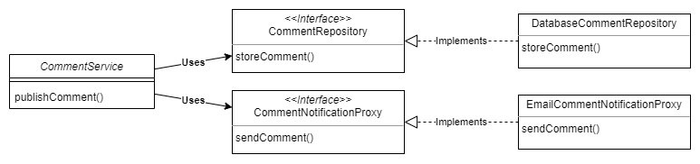

# Abstractions

## Without any framework

You are implementing an app a team uses to manage their tasks.
One of the app's features is allowing users to leave comments for the tasks.
When a user publishes a comment, it is stored somewhere (e.g. a database), and the app sends an email to a specific address configured in the app.

When analyzing the requirements, we observe that the use case consists of two actions: storing the comment and sending the comment by mail. 
As they are quite different from one another, we consider these actions to be two different responsibilities, and thus we need to implement two different objects.

In standard real-world applications, we usually refer to the object implementing a use case as *service*, an object working with database as *repository*, and an object whose responsibility is to establish communication with something outside the app as a *proxy*.
So we have the following design:



In [03-abstractions-a](03-abstractions-a/) we have an implementation of this app feature without using any dependency injection framework.
The `main()` method looks like this:

```java
public static void main(String[] args) {

    var repository = new DatabaseCommentRepository();
    var notificationProxy = new EmailCommentNotificationProxy();

    var service = new CommentService(repository, notificationProxy);
    service.publishComment(new Comment("John", "Hello World"));
}
```

Decoupling implementations through abstractions is a good practice in implementing a class design. 
Decoupling objects makes implementations easy to change without affecting too many parts of the application. 
This aspect makes your application more easily extended and maintained.

## With Spring context

You don't need to add all the app objects in the Spring context.
The main reason to add an object to the Spring context is to allow Spring to control it and further augment it with functionalities the framework provides.
So the decision should be easy and based on the question, “Does this object need to be managed by the framework?”

In our case, we need to add the object to the Spring context if it either has a dependency we need to inject from the context or if it’s a dependency itself.
The only object that doesn’t have a dependency and is also not a dependency itself is `Comment`.

Adding objects to the Spring context without needing the framework to manage them adds unnecessary complexity to your app, making the app both more challenging to maintain and less performant. 
When you add an object to the Spring context, you allow the framework to manage it with some specific functionality the framework provides. 
If you add the object to be managed by Spring without getting any benefit from the framework, you just over-engineer your implementation.

The project [03-abstractions-b](03-abstractions-b/) shows the solution using Spring.
We use stereotype annotations to add the classes `CommentService`, `DatabaseCommentRepository` and `EmailCommentNotificationProxy` to the Spring context.
We use stereotype annotations for the classes that Spring needs to create instances and add these instances to its context. 
It doesn’t make sense to add stereotype annotations on interfaces or abstract classes because these cannot be instantiated.

We use the `@Service` and `@Repository` annotations to explicitly mark the responsibilities of the components in our class design. 
Where Spring doesn’t offer a specific annotation for that responsibility, we continue to use `@Component`.

The `CommentService` class declares the dependencies to the other two components through the interfaces `CommentRepository` and `CommentNotificationProxy`. 
Spring sees the attributes are defined with interface types and is smart enough to search in its context for beans created with classes that implement these interfaces.
Now the `main()` method looks like this:

```java
public static void main(String[] args) {

    var context = new AnnotationConfigApplicationContext(ProjectConfig.class);

    var service = context.getBean(CommentService.class);
    service.publishComment(new Comment("John", "Hello World"));
}
```

## Marking an implementation as default

It’s possible that, at some point, you use a dependency that provides an implementation for a specific interface, but the provided implementation is not suitable for your app, and you choose to define your custom implementation. 
Then `@Primary` is your simplest solution.

You only need to create a custom implementation for the interface defined by the dependency and mark it as primary, so when you use DI, Spring injects your custom implementation and not the one provided by the dependency.

## Naming implementations

Sometimes, in production apps, you need to define more implementations of the same interface, and different objects use these implementations.
When you want Spring to inject one of these, you just need to specify the implementation’s name using the `@Qualifier` annotation.
